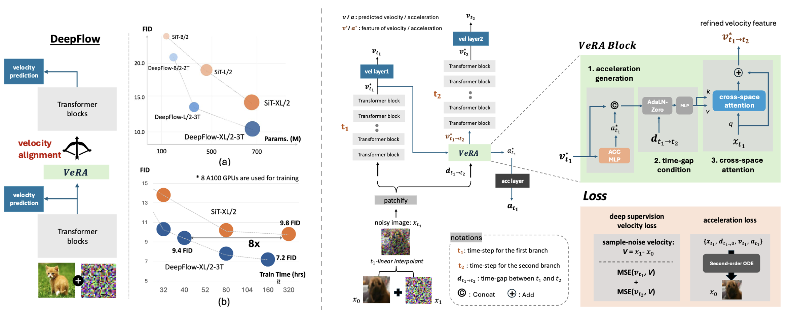

<div align="center">
 👋 Hi, everyone! 
    <br>
    We are <b>ByteDance Seed team.</b>
</div>

<p align="center">
  You can get to know us better through the following channels👇
  <br>
  <a href="https://team.doubao.com/">
    </a>
  <a href="https://github.com/user-attachments/assets/93481cda-a7f3-47f3-b333-fe6b3da86b78">
    </a>
 <a href="https://www.xiaohongshu.com/user/profile/668e7e15000000000303157d?xsec_token=ABl2-aqekpytY6A8TuxjrwnZskU-6BsMRE_ufQQaSAvjc%3D&xsec_source=pc_search">
    </a>
  <a href="https://www.zhihu.com/org/dou-bao-da-mo-xing-tuan-dui/">
    </a>
</p>


<!-- 注释：以上为Seed官方信息，可直接复制使用，请注意导入“Seed WeChat”（第12行）、“Seed logo”(第20行)图片替换 -->


# Deeply Supervised Flow-Based Generative Models

<p align="center">
  <a href="https://deepflow-project.github.io/">
    </a>
  <a href="https://arxiv.org/abs/2503.14494">
    </a>
  <!-- <a href="https://www.apache.org/licenses/">
    </a> -->
</p>

<p align="center">
    <a href="https://dlsrbgg33.github.io/" target="_blank">Inkyu&nbsp;Shin</a> &ensp; <b>&middot;</b> &ensp;
    <a href="https://www.chenglinyang.com/" target="_blank">Chenglin&nbsp;Yang</a> &ensp; <b>&middot;</b> &ensp;
    <a href="http://liangchiehchen.com/" target="_blank">Liang-Chieh&nbsp;Chen</a>
</p>


DeepFlow is a novel flow-based generation framework that enhances velocity representation through inter layer communication using deep supervision and acceleration mechanism.

DeepFlow converges 8 times faster on ImageNet with equivalent performance and further reduces FID by 2.6 while halving training time compared to previous flow based models without a classifier free guidance. 

# News
[2025/05/XX]🔥We release training code, sampling code, and checkpoints of DeepFlow.

# Introduction
DeepFlow incorporates deep supervision by evenly adding velocity prediction within transformer blocks, further enhanced by the
proposed Velocity Alignment block (VeRA).
<p>

</p>

# Getting started
## Installation
```shell
pip install -r requirements.txt
```

## Dataset
We conducted our experiments using [ImageNet](https://www.kaggle.com/competitions/imagenet-object-localization-challenge/data).
Kindly refer to preprocessing guide from [REPA](https://github.com/sihyun-yu/REPA/tree/main/preprocessing) to preprocess the dataset.

## Training
For training DeepFlow-XL/2-3T, use below training script.
```shell
bash script/xlarge/train.sh
```
where you can set following options:
- `--tg-upper-bound`: time-gap between adjacent branches
- `--weighting`: time-step sampling during training
- `--df-idxs`: key transformer layers where deep supervision is applied. (currently, equally-splitted)
- `--ssl-align`: whether to use SSL align (need to set up `--enc-type` as well)
- `--legacy-scaling`: whether to use soft-cap for scaling factor in velocity_modulation (enable this when ssl-align is enabled for reproducibility)

## Generation
For generative samples from DeepFlow-XL/2-3T, use below evaluation script.
```shell
bash script/xlarge/eval.sh
```
where you need to set specific path for checkpoint that will be evaluated.

Please follow [ADM evaluation](https://github.com/openai/guided-diffusion/tree/main/evaluations) for obtaining FID score.


## Model Zoo

We release checkpoint of DeepFlow trained on ImageNet for your reference.

| Dataset  | Model | SSL align | Training Epochs | Link | FID (wo/ CFG) | FID (w/ CFG) |
| ------------- | ------------- | ------------- | ------------- | ------------- | ------------- | ------------- |
| ImageNet-256px | DeepFlow-XL/2-3T | X | 400 | [checkpoint](https://drive.google.com/file/d/1QXTDkeVRgfvBvyLkJcu-YJ_2pDxM73Ec/view?usp=sharing) | 7.2 | 1.97 |
| ImageNet-256px | DeepFlow-XL/2-3T | O | 400 | [checkpoint](https://drive.google.com/file/d/1ALMz0Cdm1XSZYWTPSVEVR-sfYXsKk6Zl/view?usp=sharing) | 5.0 | 1.77 |


# License
The code and model weights are licensed under CC-BY-NC. See LICENSE.txt for details.


# Citation
If you find DeepFlow useful for your research and applications, feel free to give us a star ⭐ or cite us using:

```bibtex
@misc{shin2025deeply,
      title={Deeply Supervised Flow-Based Generative Models}, 
      author={Inkyu Shin and Chenglin Yang and Liang-Chieh Chen},
      year={2025},
      eprint={2503.14494},
      archivePrefix={arXiv},
      primaryClass={cs.CV},
      url={https://arxiv.org/abs/2503.14494}, 
}
```

## Acknowledgement

[DiT](https://github.com/facebookresearch/DiT)

[SiT](https://github.com/willisma/SiT)

[REPA](https://github.com/sihyun-yu/REPA)

# About [ByteDance Seed Team](https://team.doubao.com/)

Founded in 2023, ByteDance Seed Team is dedicated to crafting the industry's most advanced AI foundation models. The team aspires to become a world-class research team and make significant contributions to the advancement of science and society.
